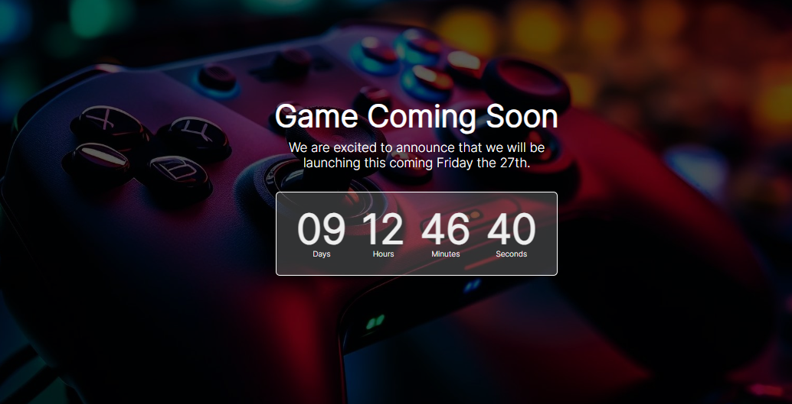

# Game Coming Soon Countdown Timer



This project is a simple countdown timer for an upcoming game release. It counts down the days, hours, minutes, and seconds remaining until the game's launch.

## Table of Contents

- [Game Coming Soon Countdown Timer](#game-coming-soon-countdown-timer)
  - [Table of Contents](#table-of-contents)
  - [Demo](#demo)
  - [Prerequisites](#prerequisites)
  - [Getting Started](#getting-started)
  - [Usage](#usage)
  - [License](#license)

## Demo

You can view a live demo of this countdown timer by opening the [index.html](index.html) file in your web browser.

## Prerequisites

There are no specific prerequisites for running this project. You only need a web browser to view the countdown timer.

## Getting Started

1. Clone this repository to your local machine or download the source code.
   
   ```bash
   git clone https://github.com/your-username/game-countdown-timer.git
   ```

2. Open the `index.html` file in your web browser.

## Usage

The countdown timer is set to count down to the launch date and time specified in the JavaScript code. By default, it is set to countdown to October 27, 2023, 23:59 SAST (South African Standard Time). You can customize the launch date and time by modifying the `targetDate` variable in the `script.js` file.

Here is how to change the target date and time:

```javascript
const targetDate = new Date("2023-10-27T23:59:00+02:00"); // SAST is UTC+2
```


- `2023-10-27` represents the launch date in "YYYY-MM-DD" format.
- `23:59:00` represents the launch time in "HH:MM:SS" format.
- `+02:00` represents the time zone offset, which is set to SAST (UTC+2) in this example. You can adjust it to match your desired time zone.

Once you have updated the `targetDate`, save the changes, and refresh the `index.html` file in your browser to see the countdown timer updated according to your new target date.


## License

This project is open-source and available under the [MIT License](LICENSE). Feel free to use, modify, and distribute it as needed.

Happy gaming!
